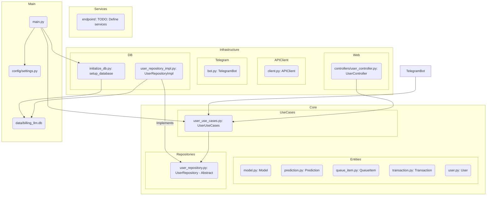

<!-- filepath: docs\\planning\\2_implement.md -->
# Implementation

We tried to implement the plan from docs\\planning\\1_planning.md
Now we need to re-check it, see what we have, and see what we have to do next

## Current state

Here's a breakdown of the current structure and classes:

**Relationships & Files:**

* **`main.py`**: Entry point, likely initializes database and potentially starts services (web/telegram).
* **`config/settings.py`**: Holds configuration values.
* **`core/entities/`**: Contains Plain Old Data Objects (Pydantic models likely) representing core concepts (User, Transaction, etc.).
* **`core/repositories/`**: Defines abstract interfaces for data access (e.g., `UserRepository`).
* **`core/use_cases/`**: Contains business logic orchestrating entities and repositories (e.g., `UserUseCases`).
* **`infra/`**: Contains implementations dealing with external systems:
  * `api_client/`: For interacting with external APIs.
  * `db/`: Database initialization (`initialize_db.py`) and concrete repository implementations (`user_repository_impl.py` using SQLite).
  * `telegram/`: Telegram bot implementation. (*TODO*)
  * `web/`: Web API controllers. (*TODO*)
* **`services/`**: Higher-level services, potentially combining use cases or interacting with infra layers. (*TODO*)
* **`data/billing_llm.db`**: SQLite database file.
* **`tests/`**: Unit and integration tests. (*TODO*)

**Problems/Footnotes:**

1. Telegram bot (`infra/telegram/bot.py`) seems basic, needs full implementation. *TODO NEED TEST*
2. Web controllers (`infra/web/controllers/`) are present but likely need implementation. *TODO NEED TEST*
3. `services/endpoint/` directory exists but is empty, needs definition and implementation. *TODO NEED TEST*
4. Only `UserRepository` has an implementation. Other repositories might be needed depending on features.
5. Test coverage is missing (`tests/` is empty). *TODO NEED TEST*
6. The exact purpose and usage of `infra/api_client/client.py` isn't clear from the structure alone.
7. Core business logic within Use Cases (like actual billing calculations) needs implementation. *TODO NEED TEST*

## User road

Simpliest user scenarios:

1. **User Registration (via Web/Telegram):**
   * User interacts with Web API or Telegram Bot.
   * Controller/Bot calls `UserUseCases.register_user(...)`.
   * `UserUseCases` creates a `User` entity.
   * `UserUseCases` calls `UserRepository.add(user)`.
   * `UserRepositoryImpl` saves the user to the `billing_llm.db`.
   * Response is sent back to the user.
2. **User Gets Balance (via Web/Telegram):**
   * User interacts with Web API or Telegram Bot.
   * Controller/Bot calls `UserUseCases.get_user_balance(user_id)`.
   * `UserUseCases` calls `UserRepository.get_by_id(user_id)`.
   * `UserRepositoryImpl` retrieves the user from `billing_llm.db`.
   * `UserUseCases` potentially calls `TransactionRepository.get_for_user(user_id)` (TODO: Needs Transaction repo/logic).
   * `UserUseCases` calculates/retrieves balance.
   * Response with balance is sent back to the user.
3. **(Admin) Add Transaction:**
   * Admin uses a specific interface (maybe CLI, dedicated endpoint).
   * Calls `TransactionUseCases.add_transaction(...)` (TODO: Needs Transaction UseCases).
   * `TransactionUseCases` creates `Transaction` entity.
   * `TransactionUseCases` calls `TransactionRepository.add(transaction)` (TODO: Needs Transaction repo).
   * `TransactionRepositoryImpl` saves transaction to `billing_llm.db`.
